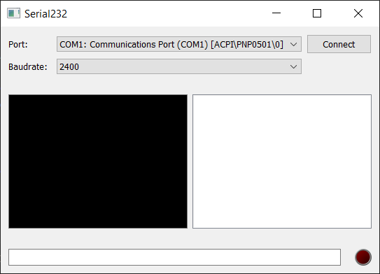

## Overview

pySconsole is a GUI built with PyQt5, designed for serial communication. It provides a user-friendly interface to interact with serial devices, display incoming data, log commands, and maintain a history of interactions. Some features are not fully fledged out or currently is a WIP.

## Features

- **Serial Port Selection**: Allows users to choose the serial port from a dropdown list.
- **Baud Rate Selection**: Provides a range of baud rates for communication speed.
- **Connect/Disconnect Button**: Enables users to establish or terminate a serial connection.
- **Real-time Data Display**: Shows incoming data from the serial device in a text browser.
- **Command History**: Logs previously sent commands for quick access and reuse.
- **Status Indicators**: Includes a LED indicator to visually represent the connection status.

## GUI Preview


## Setup Dependencies

You can either install all dependencies from `requirements.txt` to your system or safely using virtual environments with the methods below:

<Details Open>
<Summary>
VS Code Task
</Summary>

You can execute the task by choosing from the configured task in the `task.json` file. In the Terminal menu at the top next to Help, run the task for venv by selecting Terminal -> Run Task... -> *NAME OF TASK*

Build Python Environment and Install Dependencies with `venv` with the following: 

*venv:*

Run Task named *venv - Build Python Env and Install Dependencies*


</Details>
<Details>
<Summary>
Terminal
</Summary>

Build Python Environment and Install Dependencies with `venv` with the following terminal commands 

*venv:*
- Linux & macOS:

    ```bash
    python3 -m venv .venv
    source .venv/bin/activate
    python3 -m pip install --upgrade pip
    python3 -m pip install -r requirements.txt
    deactivate .venv
    ```

- Windows:

    ```batch
    if not exist .venv py -m venv .venv
    .\.venv\Scripts\activate.bat
    py -m pip install --upgrade pip
    py -m pip install -r requirements.txt
    deactivate .venv
        ```
</Details>


## Intended Usage

1. **Launching the Application**: Either run via vscode from `launch.json` and run *pySconsole Run* or run `python pySconsole.py` from the command line.
2. **Connecting to a Serial Device**: Select the appropriate serial port and baud rate, then click **Connect**.
3. **Sending Commands**: Type commands in the input field at the bottom and press Enter. Commands will be logged in the history.
4. **Viewing Data**: Incoming data from the serial device will appear in real-time in the middle section of the GUI.
5. **Disconnecting**: Click **Disconnect** to terminate the serial connection.

